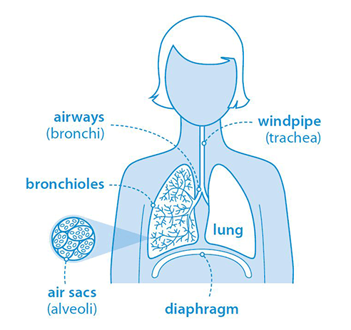
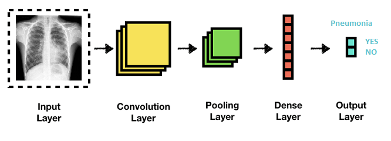

# pneumonia-detection
A two-headed classification model to detect pneumonia using neural networks and traditional machine learning.

## Notes
Due to the big ammount of the data needed to train the models ("chest_xray") it was not possible to include them in the uploaded ZIP file. In order to rerun the Jupyter notebok, a folder named "Data" should be created, which folder should contain the folder "chest_xray" which has the data as they were downloaded from [kaggle](https://www.kaggle.com/paultimothymooney/chest-xray-pneumonia). Also, the results from the models and from some specific preprocessing steps are already provided, along with certain images, which could also be presented if the Jupyter notebook is executed.

## **What is pneumonia?**

Pneumonia is an inflammatory condition of the lung primarily affecting the small air sacs known as alveoli.  Symptoms typically include some combination of productive or dry cough, chest pain, fever and difficulty breathing. The severity of the condition is variable.   

 

 

## **Types**

Pneumonia is usually caused by infection with viruses or bacteria, and less commonly by other microorganisms. Identifying the responsible pathogen can be difficult. 
  
**Bacterial Pneumonia**

Bacteria cause most cases of community-acquired pneumonia in adults.
One can catch pneumonia when someone who is infected coughs or sneezes. Bacteria-filled droplets get into the air, where they breathe them via the nose or mouth.
  
**Viral Pneumonia**

Viruses are the second most common cause of pneumonia. Many kinds cause the disease, including some of the same viruses that bring on colds and flu and the coronavirus that causes COVID-19.
  
**Fungal Pneumonia**

Fungi are a less common cause of pneumonia. It is not likely to get fungal pneumonia if the person is healthy. 

 

 

## **Diagnosis**

Diagnosis is often based on symptoms and physical examination. An important test for making a diagnosis of pneumonia is a chest x-ray. Chest x-rays can reveal areas of opacity (seen as white) which represent consolidation. Pneumonia is not always seen on x-rays, either because the disease is only in its initial stages, or because it involves a part of the lung not easily seen by x-ray.

## **Detection Process**

*    **Neural Network Approach**

 

CNNs are deep neural networks for which the primarily used input is images. CNNs learn the filters (features) that are hand-engineered in traditional algorithms. This independence from prior knowledge and human effort in feature design is a major advantage. They also reduce the number of parameters to be learned with their shared-weights architecture and possess translation invariance characteristics.

*    **Traditional Machine Learning Method**

SVM is a supervised machine learning technique which in general can be used in order to solve regression and classification problems, but it is more frequently used for the latter one. SVM is based on estimating the best possible hyperplane which can divide the points of the different groups in the data. The data may exist on multiple dimensions and the hyperplane is determined based on specific criteria which lead to the "best" possible seperation of the groups in the data, thus to achieve the proper classification of new data points. Also, the hyperplane can be set of specific nature (e.g. linear, polynomial).
