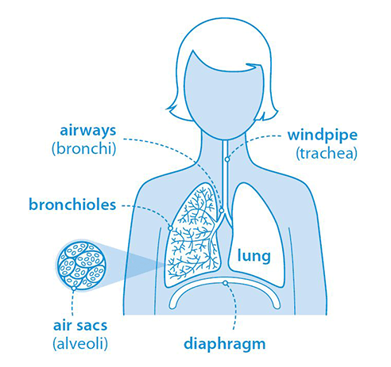

# pneumonia-detection
A two-headed classification model to detect pneumonia using neural networks and traditional machine learning.

# Notes
Due to the big ammount of the data needed to train the models ("chest_xray") it was not possible to include them in the uploaded ZIP file. In order to rerun the Jupyter notebok, a folder named "Data" should be created, which folder should contain the folder "chest_xray" which has the data as they were downloaded from [kaggle](https://www.kaggle.com/paultimothymooney/chest-xray-pneumonia). Also, the results from the models and from some specific preprocessing steps are already provided, along with certain images, which could also be presented if the Jupyter notebook is executed.

 

 
